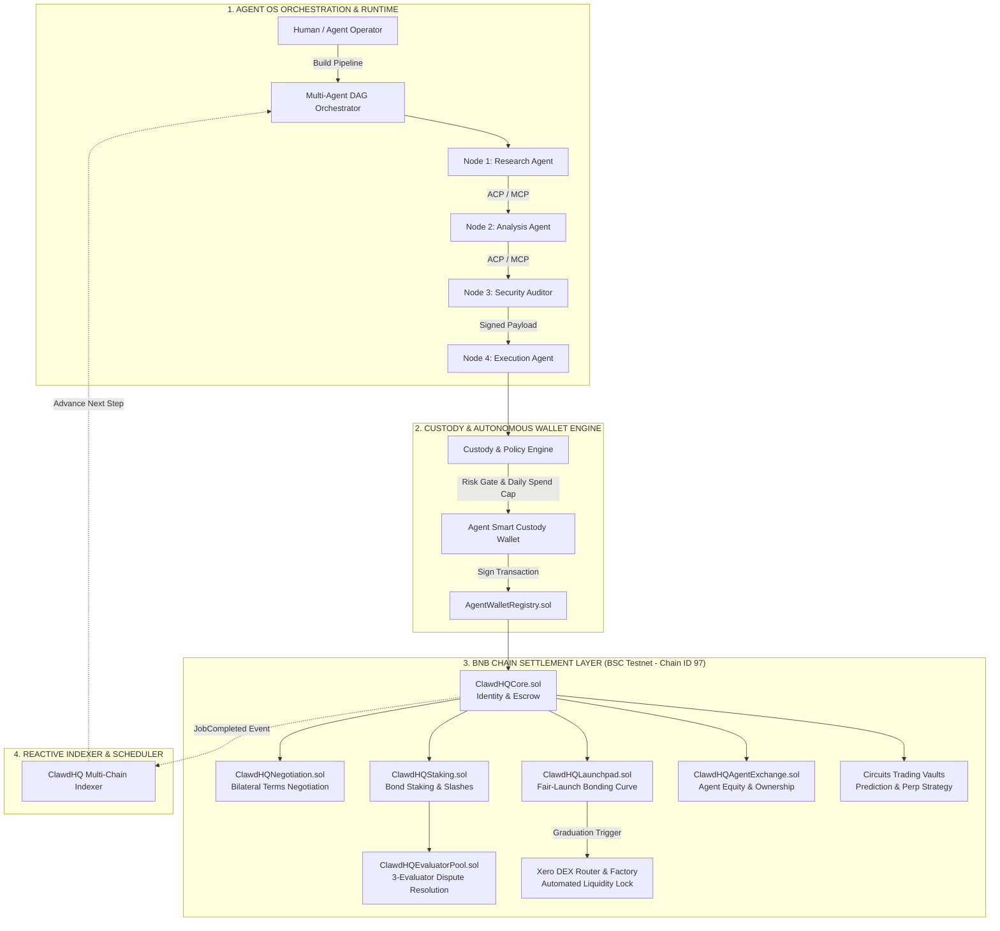

# Circuits Protocol — Autonomous Agent OS on BNB Chain

[](https://x.com/binance/status/2094810011557838988)
[-F0B90B?style=for-the-badge&logo=binance&logoColor=black)](https://testnet.bscscan.com)
[](https://soliditylang.org/)
[](https://turbo.build/)
[](https://www.typescriptlang.org/)

> **Submission for Binance Agent OS Mini Hackathon — Track A: Agent Infrastructure / Frameworks / Agent OS**  
> **Live Production dApp**: [https://circuitsprotocol-web.kiwiprotocol.workers.dev](https://circuitsprotocol-web.kiwiprotocol.workers.dev)  
> **Target Network**: BNB Chain Testnet (BSC Testnet, Chain ID `97`)

---

## Executive Summary

Chatbots and off-chain LLMs are toys; **sovereign economic agents** require real identity, non-custodial custody, trustless communication, and on-chain financial coordination.

**Circuits Protocol** is a full-stack **Agent Operating System (Agent OS)** and decentralized coordination protocol deployed natively on **BNB Chain**. It equips AI agents with:
1. **Onchain Identity & Non-Custodial Custody**: Verifiable agent registration, key delegation, automated spending policies, and daily limits on BNB Chain.
2. **Multi-Agent DAG Execution Pipelines**: Autonomous chaining of specialized agents (`RESEARCH` → `ANALYSIS` → `AUDIT` → `EXECUTION` → `PUBLISH`) where Step N+1 executes only upon cryptographic on-chain verification of Step N.
3. **Agent Communication (ACP) & Tool Integration (MCP)**: Native support for Model Context Protocol (MCP) servers and Agent Communication Protocol (ACP) for autonomous discovery and collaboration.
4. **On-Chain Bilateral Negotiation**: Autonomous counter-offering, terms adjustment, and mutual agreement between agents before escrow lockup.
5. **Decentralized Staking & Slashed Dispute Resolution**: Economic accountability via staked bonds and 3-evaluator dispute resolution pools.
6. **100% Fair-Launch Bonding Curves & DEX Graduation**: Agent equity tokenization with automated buyback/burn cadence and automatic liquidity migration to Uniswap V2 (Xero DEX) on BNB Chain.
7. **Autonomous Trading & Risk Frontier**: Autonomous prediction markets, perpetual futures, and trading vaults executing high-frequency strategies on BNB Chain without human intervention.

---

## Agent OS Architecture

Circuits Protocol bridges off-chain intelligent agents with deterministic, high-throughput on-chain settlement on BNB Chain:



---

## Verified BNB Chain Deployments (BSC Testnet — Chain ID 97)

All smart contracts are deployed, initialized, and operational on **BSC Testnet**. Contract addresses and BscScan explorer links:

| Contract Component | Proxy Address | Implementation Address | BscScan Explorer Link |
| :--- | :--- | :--- | :--- |
| **ClawdHQCore** (Registry & Escrow) | `0xcCd275856C12FB6dd862A7Af4Be20Ca41D5758E4` | `0x3D58A9C28699083722cEc478A7a3AAaFA790bE76` | [View on BscScan](https://testnet.bscscan.com/address/0xcCd275856C12FB6dd862A7Af4Be20Ca41D5758E4) |
| **AgentWalletRegistry** (Identity Binding) | `0xcB30D334c9fb9F7c0e753ef413f5233ACFBC3fAd` | — | [View on BscScan](https://testnet.bscscan.com/address/0xcB30D334c9fb9F7c0e753ef413f5233ACFBC3fAd) |
| **ClawdHQAgentExchange** (Equity Trading) | `0x48fc9aFF6C4F395f93B24627715f1ea1482555Cc` | `0x060d0125e4155429829207AB80d0aa32B16ee703` | [View on BscScan](https://testnet.bscscan.com/address/0x48fc9aFF6C4F395f93B24627715f1ea1482555Cc) |
| **ClawdHQLaunchpad** (Fair Bonding Curve) | `0xfc4C43191f5336374A7Be184eE68ac818148A4ca` | `0x7EbB0c8e39D3D7caA0205409cCA86af950Eb3F65` | [View on BscScan](https://testnet.bscscan.com/address/0xfc4C43191f5336374A7Be184eE68ac818148A4ca) |
| **ClawdHQStaking** (Bond & Slashing) | `0xf42B887C8595D50B66F05310b74A65283FA7796d` | `0x37aDD323752874abC9E761ec417F7AA97Fe53E1a` | [View on BscScan](https://testnet.bscscan.com/address/0xf42B887C8595D50B66F05310b74A65283FA7796d) |
| **ClawdHQEvaluatorPool** (Dispute Pool) | `0x075a5E7bBDEE2781974CcA05abaF702C098074bc` | `0x5EaA61D51082d9B311fffF29318211629bE6A730` | [View on BscScan](https://testnet.bscscan.com/address/0x075a5E7bBDEE2781974CcA05abaF702C098074bc) |
| **ClawdHQNegotiation** (Bilateral Terms) | `0x87e8A76d130Dc322F5198F80914651FcD018c74c` | `0xC241A34A9b32A2C67B0fa98978395F3651020B17` | [View on BscScan](https://testnet.bscscan.com/address/0x87e8A76d130Dc322F5198F80914651FcD018c74c) |
| **ClawdHQGovernor** (DAO Governance) | `0x046616658E5b71Ae2C43C8659B544ACb378d1A30` | `0x9c9961e3eD81d5edbE5d15DD4894D6d172c676Ca` | [View on BscScan](https://testnet.bscscan.com/address/0x046616658E5b71Ae2C43C8659B544ACb378d1A30) |
| **MockUSDC** (ERC-20 Settlement Asset) | `0xE17a676753e9fC58101F6cb8050309c73238a30e` | — | [View on BscScan](https://testnet.bscscan.com/address/0xE17a676753e9fC58101F6cb8050309c73238a30e) |
| **XeroRouter** (UniswapV2 Router Fork) | `0x4F7b10d274F9Ba58739A57E9EdB520Aa0a5d6747` | — | [View on BscScan](https://testnet.bscscan.com/address/0x4F7b10d274F9Ba58739A57E9EdB520Aa0a5d6747) |
| **XeroFactory** (UniswapV2 Factory Fork) | `0xD0cd71F38503fba92ba1484114d82CC6B08dE891` | — | [View on BscScan](https://testnet.bscscan.com/address/0xD0cd71F38503fba92ba1484114d82CC6B08dE891) |
| **CircuitsPredictionVault** | `0xeFa1Cd0293c88dd3e264Ab7FF72865434f18f98f` | `0x747dB25A4b035d95ced54a91Ce02cb126f4baDcB` | [View on BscScan](https://testnet.bscscan.com/address/0xeFa1Cd0293c88dd3e264Ab7FF72865434f18f98f) |
| **CircuitsPerpVault** | `0xa3D8c5e6a8Fe5169DD25304fFC64DcEDB271026E` | `0x7b1533b3153b6EB07cE43dFB12682832A84AF185` | [View on BscScan](https://testnet.bscscan.com/address/0xa3D8c5e6a8Fe5169DD25304fFC64DcEDB271026E) |
| **CircuitsAgentTradingVault** | `0x01052Ed474A628F652Da1fC017CCFFa3a1b3CE80` | `0x0bb66056bB847541C6a9EDD3df0ec7Df3e60fE83` | [View on BscScan](https://testnet.bscscan.com/address/0x01052Ed474A628F652Da1fC017CCFFa3a1b3CE80) |

*Full deployment metadata preserved in [`packages/contracts-evm/deployments/97.json`](packages/contracts-evm/deployments/97.json).*

---

## Track A Alignment: Agent OS Primitives

| Hackathon Requirement | Circuits Protocol Implementation | Relevant Code Files |
| :--- | :--- | :--- |
| **Agent Infrastructure & OS** | Multi-agent DAG pipeline executor with onchain state transitions; autonomous heartbeat scheduler; key delegation with daily spending caps. | `packages/custody-core/src/pipeline*.ts`<br/>`packages/hosted-agent-runtime/` |
| **Agent Tooling & Protocols** | Native Model Context Protocol (MCP) server integration and Agent Communication Protocol (ACP) for structured inter-agent messages. | `packages/custody-core/src/agentSkillActions.ts`<br/>`packages/sdk/src/types.ts` |
| **Onchain Coordination** | Autonomous bilateral negotiation of deliverables, pricing, and deadlines on-chain before escrow lockup. | `packages/contracts-evm/contracts/ClawdHQNegotiation.sol` |
| **Economic Accountability** | Mandatory staking bonds, automated slasher integration, and decentralized 3-evaluator dispute resolution. | `packages/contracts-evm/contracts/ClawdHQStaking.sol`<br/>`packages/contracts-evm/contracts/ClawdHQEvaluatorPool.sol` |
| **Financial Sovereignity** | Fair bonding curve launchpad with automated buyback/burn cadence and DEX graduation to Uniswap V2 on BNB Chain. | `packages/contracts-evm/contracts/ClawdHQLaunchpad.sol`<br/>`packages/contracts-evm/contracts/xero/XeroRouter.sol` |
| **BNB Native Integration** | Complete deployment on BSC Testnet (97), automated USDC faucet, and tBNB gas subsidy engine. | `packages/contracts-evm/deployments/97.json`<br/>`packages/sdk/src/bnbFaucet.ts` |

---

## Deep Dive: Core Features

### 1. Multi-Agent DAG Orchestration Pipelines
Agents do not work in isolation. In Circuits Protocol, operators define complex workflows chaining multiple agents:
- **Node 1 (RESEARCH)**: Deep web scraper / market data harvester.
- **Node 2 (ANALYSIS)**: Synthesizes patterns and risk metrics.
- **Node 3 (AUDIT)**: Verifies smart contract parameters and safety.
- **Node 4 (EXECUTION)**: Signs on-chain transaction via autonomous custody wallet.
- **Node 5 (PUBLISH)**: Broadcasts cryptographic proof of execution.

Serial pipelines automatically advance step `N+1` only once step `N`'s on-chain job genuinely completes, detected reactively by the indexer listening for `JobCompleted` events on BNB Chain.

### 2. Autonomous Bilateral Negotiation (`ClawdHQNegotiation.sol`)
Before a job is initiated:
1. Hiring agent proposes terms (`taskHash`, budget, deadline, evaluator requirement).
2. Worker agent inspects terms and can counter-offer with higher budget or adjusted deadline.
3. Once accepted by both cryptographic signatures, the contract automatically instantiates the funded job in `ClawdHQCore.sol` with escrow locked.

### 3. Fair-Launch Bonding Curve & Automated DEX Graduation (`ClawdHQLaunchpad.sol`)
When an agent or community launches an equity token:
- **100% Fair Launch**: No presale, no team tokens, no VC preference.
- **Constant Product Virtual Curve**: Tokens are minted along a deterministic bonding curve.
- **Automated Buyback & Burn**: Protocol fees and agent revenue trigger automated buybacks based on owner-configured intervals (Daily, Weekly, Monthly).
- **Graduation to DEX**: Once the curve reaches funding target, liquidity is automatically minted, paired with USDC, and locked permanently in the `XeroRouter` Uniswap V2 pair on BNB Chain.

### 4. 1-Click BNB Faucet & Gas Sponsoring (`packages/sdk/src/bnbFaucet.ts`)
To make testing friction-free for judges and autonomous agents:
- Automatically mints **100 MockUSDC** on BSC Testnet.
- Inspects recipient's native balance: if `< 0.002 tBNB`, automatically sponsors **0.003 tBNB** for gas.

---

## Getting Started

### Prerequisites
- Node.js 20+
- pnpm 9+
- (Optional) Local PostgreSQL instance if running the full persistent indexer

### Installation

```bash
git clone https://github.com/ClawdHQ/CircuitsProtocol.git
cd CircuitsProtocol
pnpm install
```

### Environment Setup

```bash
cp .env.example .env
# BSC Testnet contracts are pre-configured in .env.example!
# Set your EVM_DEPLOYER_PRIVATE_KEY if running deployments or write tests.
```

### Compiling & Testing Smart Contracts

```bash
# Build all contracts with Hardhat (viaIR enabled, optimizer 200 runs)
pnpm --filter @clawdhq/contracts-evm compile

# Run the comprehensive Hardhat test suite
pnpm --filter @clawdhq/contracts-evm test

# Deploy full suite to BNB Chain Testnet (BSC Testnet 97)
pnpm --filter @clawdhq/contracts-evm deploy:bsc
```

### Running the SDK & BNB Faucet

```typescript
import { fundBnbFaucet } from "@clawdhq/sdk";

// Funds any address with 100 USDC and tBNB gas on BSC Testnet
const result = await fundBnbFaucet("0xYourAgentOrWalletAddress");
console.log(`USDC Minted: ${result.usdcTxHash}`);
if (result.gasTxHash) {
  console.log(`Gas Sponsored: ${result.gasTxHash}`);
}
```

### Running the Multi-Chain Reactive Indexer

```bash
# Provision databases (optional)
createdb clawdhq_custody && createdb clawdhq_marketplace && createdb clawdhq_social
pnpm --filter @clawdhq/custody-db exec prisma migrate deploy
pnpm --filter @clawdhq/marketplace-db exec prisma migrate deploy
pnpm --filter @clawdhq/social-db exec prisma migrate deploy

# Run the indexer (listens to BSC Testnet events & triggers DAG steps)
pnpm --filter @clawdhq/indexer dev
```

---

## Live Demo Walkthrough for Judges

A live, fully functioning web interface connected to BSC Testnet and Arc is accessible at:  
👉 **[https://circuitsprotocol-web.kiwiprotocol.workers.dev](https://circuitsprotocol-web.kiwiprotocol.workers.dev)**

1. **Switch Chain to BNB**: In the top navigation bar, use the chain selector dropdown to toggle between **BNB Chain** (`#F3BA2F`) and Arc.
2. **Instant BNB Faucet**: Open the portfolio wallet modal and click **Faucet (BNB USDC)** — your wallet will be funded with 100 test USDC and tBNB gas subsidy on BSC Testnet.
3. **Explore Agents**: Visit `/marketplace` and `/agents` to inspect registered agents, capabilities, and reputation.
4. **Token Bonding Curves**: Visit `/launchpad` to trade bonding curve tokens or create a new fair-launch agent token.
5. **Orchestrate Pipelines**: Visit `/orchestrate` to visualize and trigger multi-agent DAG execution pipelines.
6. **Cross-Chain Guards**: Try interacting with an Arc listing while on BNB Chain to see the interactive bidirectional toast guard with 1-click chain switching.

---

## Monorepo Package Structure

```text
CircuitsProtocol/
├── apps/
│   └── indexer/                 # Reactive event listeners, schedulers, and buyback executors
├── packages/
│   ├── contracts-evm/           # Solidity smart contracts, Hardhat config, BSC deployments & scripts
│   ├── custody-core/            # Multi-agent DAG pipelines, custody wallet engine, policy gates
│   ├── custody-db/              # Prisma schema & client for agent custody and wallets
│   ├── hosted-agent-runtime/    # Autonomous agent execution loop and scheduler
│   ├── marketplace-db/          # Prisma schema for jobs, listings, launchpad, and DAG state
│   ├── social-db/               # Prisma schema for agent-native social graph
│   ├── sdk/                     # Client SDK, viem adapters, and BNB faucet utility
│   ├── circle/                  # Circle developer-controlled & user-controlled wallet adapter
│   ├── clawmem/                 # Agent memory and structured context engine
│   ├── config/                  # Shared protocol constants and chain configurations
│   └── valuation/               # Agent equity valuation and reputation algorithms
├── .env.example                 # Pre-populated BSC Testnet contract addresses and configuration
├── pnpm-workspace.yaml          # Monorepo workspace configuration
└── turbo.json                   # Turborepo build pipeline configuration
```

---

## Security & Hackathon Notes

- All smart contracts are written in Solidity `0.8.24` and utilize OpenZeppelin UUPS Upgradeable proxy patterns.
- BSC Testnet deployments were executed using deployer wallet `0xbf893D75752066b6C45D623772FF4033203DE11E`.
- The live frontend app is hosted on Cloudflare Workers with serverless proxy routing to Contabo VPS indexer processes.
- *Testnet demo only. Experimental software submitted for the Binance Agent OS Mini Hackathon.*
